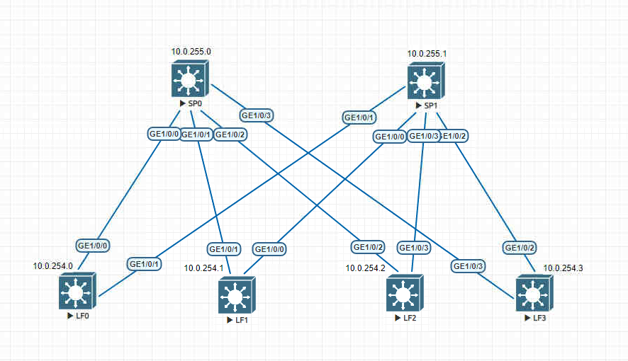

# Underlay. OSPF

### Задание: 
Настроить OSPF для Underlay сети

### Схема:


### Таблица распределения IP-адресов
| Sysname       | IP                | Desc |
| ------------- |:------------------:| -----:|
| **SP0**     | **10.0.255.0/32**   |**Loop**|
| SP0    | 10.0.0.1/30 |  LF0 |
| SP0  | 10.0.0.5/30        |   LF1|
| SP0  | 10.0.0.9/30        |   LF2 |
| SP0  | 10.0.0.13/30        |   LF3 |
| **SP1**     | **10.0.255.1/32**   |**Loop** |
| SP1    | 10.0.1.1/30 |  LF0 |
| SP1  | 10.0.1.5/30        |   LF1|
| SP1  | 10.0.1.9/30        |   LF2 |
| SP1  | 10.0.1.13/30        |   LF23 |
| **LF0**     | **10.0.254.0/32**   |**Loop** |
| LF0  | 10.0.0.2/30        |   SP0|
| LF0  | 10.0.1.2/30        |   SP1 |
| **LF1**    | **10.0.254.1/32**   |**Loop** |
| LF1  | 10.0.0.6/30        |   SP0|
| LF1  | 10.0.1.6/30        |   SP1 |
| **LF2**    | **10.0.254.2/32**   |**Loop** |
| LF2  | 10.0.0.10/30        |   SP0|
| LF2  | 10.0.1.10/30        |   SP1 |
| **LF3**    | **10.0.254.3/32**   |**Loop** |
| LF3  | 10.0.0.14/30        |   SP0|
| LF3  | 10.0.1.14/30        |   SP1 |

### Выводы SP0:
``` 
<SP0>dis ospf peer br
OSPF Process 255 with Router ID 10.0.255.0
                   Peer Statistic Information
Total number of peer(s): 4
 Peer(s) in full state: 4
-----------------------------------------------------------------------------
 Area Id         Interface                  Neighbor id          State
 0.0.0.0         GE1/0/0                    10.0.254.0           Full
 0.0.0.0         GE1/0/1                    10.0.254.1           Full
 0.0.0.0         GE1/0/2                    10.0.254.2           Full
 0.0.0.0         GE1/0/3                    10.0.254.3           Full
-----------------------------------------------------------------------------
``` 
``` 
<SP0>dis bfd session all
S: Static session
D: Dynamic session
IP: IP session
IF: Single-hop session
PEER: Multi-hop session
LDP: LDP session
LSP: Label switched path
TE: Traffic Engineering
AUTO: Automatically negotiated session
VXLAN: VXLAN session
VSI: VSI PW session
(w): State in WTR
(*): State is invalid
Total UP/DOWN Session Number : 4/0
--------------------------------------------------------------------------------
Local      Remote     PeerIpAddr      State     Type        InterfaceName
--------------------------------------------------------------------------------
16385      16385      10.0.0.2        Up        D/IP-IF      GE1/0/0
16386      16385      10.0.0.6        Up        D/IP-IF      GE1/0/1
16387      16385      10.0.0.10       Up        D/IP-IF      GE1/0/2
16388      16385      10.0.0.14       Up        D/IP-IF      GE1/0/3
--------------------------------------------------------------------------------
``` 
``` 
<SP0>dis ip rou
Proto: Protocol        Pre: Preference
Route Flags: R - relay, D - download to fib, T - to vpn-instance, B - black hole route
------------------------------------------------------------------------------
Routing Table : _public_
         Destinations : 26       Routes : 29

Destination/Mask    Proto   Pre  Cost        Flags NextHop         Interface

       10.0.0.0/30  Direct  0    0             D   10.0.0.1        GE1/0/0
       10.0.0.1/32  Direct  0    0             D   127.0.0.1       GE1/0/0
       10.0.0.3/32  Direct  0    0             D   127.0.0.1       GE1/0/0
       10.0.0.4/30  Direct  0    0             D   10.0.0.5        GE1/0/1
       10.0.0.5/32  Direct  0    0             D   127.0.0.1       GE1/0/1
       10.0.0.7/32  Direct  0    0             D   127.0.0.1       GE1/0/1
       10.0.0.8/30  Direct  0    0             D   10.0.0.9        GE1/0/2
       10.0.0.9/32  Direct  0    0             D   127.0.0.1       GE1/0/2
      10.0.0.11/32  Direct  0    0             D   127.0.0.1       GE1/0/2
      10.0.0.12/30  Direct  0    0             D   10.0.0.13       GE1/0/3
      10.0.0.13/32  Direct  0    0             D   127.0.0.1       GE1/0/3
      10.0.0.15/32  Direct  0    0             D   127.0.0.1       GE1/0/3
       10.0.1.0/30  OSPF    10   2             D   10.0.0.2        GE1/0/0
       10.0.1.4/30  OSPF    10   2             D   10.0.0.6        GE1/0/1
       10.0.1.8/30  OSPF    10   2             D   10.0.0.10       GE1/0/2
      10.0.1.12/30  OSPF    10   2             D   10.0.0.14       GE1/0/3
     10.0.254.0/32  OSPF    10   1             D   10.0.0.2        GE1/0/0
     10.0.254.1/32  OSPF    10   1             D   10.0.0.6        GE1/0/1
     10.0.254.2/32  OSPF    10   1             D   10.0.0.10       GE1/0/2
     10.0.254.3/32  OSPF    10   1             D   10.0.0.14       GE1/0/3
     10.0.255.0/32  Direct  0    0             D   127.0.0.1       LoopBack0
     10.0.255.1/32  OSPF    10   2             D   10.0.0.14       GE1/0/3
                    OSPF    10   2             D   10.0.0.10       GE1/0/2
                    OSPF    10   2             D   10.0.0.6        GE1/0/1
                    OSPF    10   2             D   10.0.0.2        GE1/0/0
      127.0.0.0/8   Direct  0    0             D   127.0.0.1       InLoopBack0
      127.0.0.1/32  Direct  0    0             D   127.0.0.1       InLoopBack0
127.255.255.255/32  Direct  0    0             D   127.0.0.1       InLoopBack0
255.255.255.255/32  Direct  0    0             D   127.0.0.1       InLoopBack0
``` 

### Выводы SP1:
``` 
SP1>dis ospf peer br
OSPF Process 255 with Router ID 10.0.255.1
                   Peer Statistic Information
Total number of peer(s): 4
 Peer(s) in full state: 4
-----------------------------------------------------------------------------
 Area Id         Interface                  Neighbor id          State
  0.0.0.0         GE1/0/0                    10.0.254.1           Full
  0.0.0.0         GE1/0/1                    10.0.254.0           Full
  0.0.0.0         GE1/0/2                    10.0.254.3           Full
  0.0.0.0         GE1/0/3                    10.0.254.2           Full
-----------------------------------------------------------------------------

``` 
``` 
<SP1>dis bfd session all
S: Static session
D: Dynamic session
IP: IP session
IF: Single-hop session
PEER: Multi-hop session
LDP: LDP session
LSP: Label switched path
TE: Traffic Engineering
AUTO: Automatically negotiated session
VXLAN: VXLAN session
VSI: VSI PW session
(w): State in WTR
(*): State is invalid
Total UP/DOWN Session Number : 4/0
--------------------------------------------------------------------------------
Local      Remote     PeerIpAddr      State     Type        InterfaceName
--------------------------------------------------------------------------------
16385      16386      10.0.1.10       Up        D/IP-IF      GE1/0/3
16386      16386      10.0.1.6        Up        D/IP-IF      GE1/0/0
16387      16386      10.0.1.2        Up        D/IP-IF      GE1/0/1
16388      16386      10.0.1.14       Up        D/IP-IF      GE1/0/2
--------------------------------------------------------------------------------
``` 
``` 
<SP1>dis ip rou
Proto: Protocol        Pre: Preference
Route Flags: R - relay, D - download to fib, T - to vpn-instance, B - black hole route
------------------------------------------------------------------------------
Routing Table : _public_
         Destinations : 26       Routes : 29

Destination/Mask    Proto   Pre  Cost        Flags NextHop         Interface
       10.0.0.0/30  OSPF    10   2             D   10.0.1.2        GE1/0/1
       10.0.0.4/30  OSPF    10   2             D   10.0.1.6        GE1/0/0
       10.0.0.8/30  OSPF    10   2             D   10.0.1.10       GE1/0/3
      10.0.0.12/30  OSPF    10   2             D   10.0.1.14       GE1/0/2
       10.0.1.0/30  Direct  0    0             D   10.0.1.1        GE1/0/1
       10.0.1.1/32  Direct  0    0             D   127.0.0.1       GE1/0/1
       10.0.1.3/32  Direct  0    0             D   127.0.0.1       GE1/0/1
       10.0.1.4/30  Direct  0    0             D   10.0.1.5        GE1/0/0
       10.0.1.5/32  Direct  0    0             D   127.0.0.1       GE1/0/0
       10.0.1.7/32  Direct  0    0             D   127.0.0.1       GE1/0/0
       10.0.1.8/30  Direct  0    0             D   10.0.1.9        GE1/0/3
       10.0.1.9/32  Direct  0    0             D   127.0.0.1       GE1/0/3
      10.0.1.11/32  Direct  0    0             D   127.0.0.1       GE1/0/3
      10.0.1.12/30  Direct  0    0             D   10.0.1.13       GE1/0/2
      10.0.1.13/32  Direct  0    0             D   127.0.0.1       GE1/0/2
      10.0.1.15/32  Direct  0    0             D   127.0.0.1       GE1/0/2
     10.0.254.0/32  OSPF    10   1             D   10.0.1.2        GE1/0/1    
     10.0.254.1/32  OSPF    10   1             D   10.0.1.6        GE1/0/0
     10.0.254.2/32  OSPF    10   1             D   10.0.1.10       GE1/0/3
     10.0.254.3/32  OSPF    10   1             D   10.0.1.14       GE1/0/2
     10.0.255.0/32  OSPF    10   2             D   10.0.1.10       GE1/0/3
                    OSPF    10   2             D   10.0.1.14       GE1/0/2
                    OSPF    10   2             D   10.0.1.2        GE1/0/1
                    OSPF    10   2             D   10.0.1.6        GE1/0/0
     10.0.255.1/32  Direct  0    0             D   127.0.0.1       LoopBack0
      127.0.0.0/8   Direct  0    0             D   127.0.0.1       InLoopBack0
      127.0.0.1/32  Direct  0    0             D   127.0.0.1       InLoopBack0
127.255.255.255/32  Direct  0    0             D   127.0.0.1       InLoopBack0
255.255.255.255/32  Direct  0    0             D   127.0.0.1       InLoopBack0  
``` 