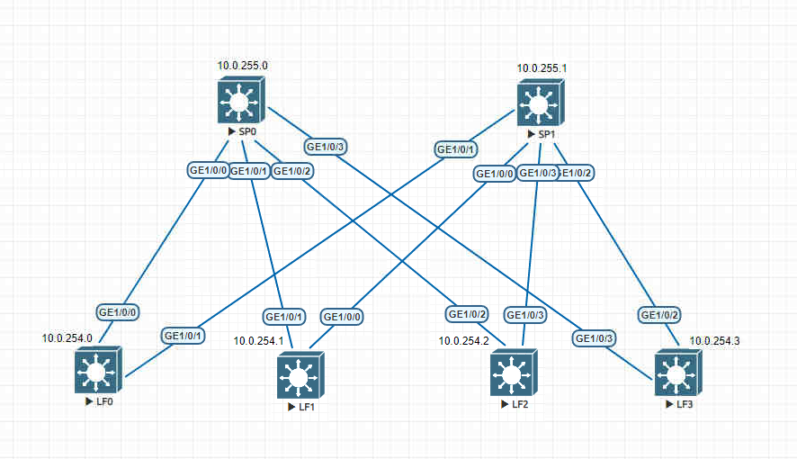

# Underlay. ISIS

### Задание: 
Настроить ISIS для Underlay сети

### Схема:


### Таблица распределения IP-адресов
| Sysname       | IP                | Desc |
| ------------- |:------------------:| -----:|
| **SP0**     | **10.0.255.0/32**   |**Loop**|
| SP0    | 10.0.0.1/30 |  LF0 |
| SP0  | 10.0.0.5/30        |   LF1|
| SP0  | 10.0.0.9/30        |   LF2 |
| SP0  | 10.0.0.13/30        |   LF3 |
| **SP1**     | **10.0.255.1/32**   |**Loop** |
| SP1    | 10.0.1.1/30 |  LF0 |
| SP1  | 10.0.1.5/30        |   LF1|
| SP1  | 10.0.1.9/30        |   LF2 |
| SP1  | 10.0.1.13/30        |   LF23 |
| **LF0**     | **10.0.254.0/32**   |**Loop** |
| LF0  | 10.0.0.2/30        |   SP0|
| LF0  | 10.0.1.2/30        |   SP1 |
| **LF1**    | **10.0.254.1/32**   |**Loop** |
| LF1  | 10.0.0.6/30        |   SP0|
| LF1  | 10.0.1.6/30        |   SP1 |
| **LF2**    | **10.0.254.2/32**   |**Loop** |
| LF2  | 10.0.0.10/30        |   SP0|
| LF2  | 10.0.1.10/30        |   SP1 |
| **LF3**    | **10.0.254.3/32**   |**Loop** |
| LF3  | 10.0.0.14/30        |   SP0|
| LF3  | 10.0.1.14/30        |   SP1 |

### Выводы SP0:
``` 
<SP0>dis isis peer

Peer Information for ISIS(255)
--------------------------------------------------------------------------------

  System ID     Interface       Circuit ID        State HoldTime(s) Type     PRI
--------------------------------------------------------------------------------
1000.0025.4000  GE1/0/0         0000000005         Up            25 L1        --
1000.0025.4100  GE1/0/1         0000000006         Up            26 L1        --
1000.0025.4200  GE1/0/2         0000000007         Up            25 L1        --
1000.0025.4300  GE1/0/3         0000000008         Up            24 L1        --

Total Peer(s): 4
``` 
``` 
<SP0>dis bfd se al
S: Static session
D: Dynamic session
IP: IP session
IF: Single-hop session
PEER: Multi-hop session
LDP: LDP session
LSP: Label switched path
TE: Traffic Engineering
AUTO: Automatically negotiated session
VXLAN: VXLAN session
VSI: VSI PW session
(w): State in WTR
(*): State is invalid
Total UP/DOWN Session Number : 4/0
--------------------------------------------------------------------------------
Local      Remote     PeerIpAddr      State     Type        InterfaceName
--------------------------------------------------------------------------------
16385      16385      10.0.0.2        Up        D/IP-IF      GE1/0/0
16386      16386      10.0.0.6        Up        D/IP-IF      GE1/0/1
16387      16385      10.0.0.10       Up        D/IP-IF      GE1/0/2
16388      16386      10.0.0.14       Up        D/IP-IF      GE1/0/3
--------------------------------------------------------------------------------
``` 
``` 
<SP0>dis ip rou | i ISIS
Proto: Protocol        Pre: Preference
Route Flags: R - relay, D - download to fib, T - to vpn-instance, B - black hole route
------------------------------------------------------------------------------
Routing Table : _public_
         Destinations : 26       Routes : 29

Destination/Mask    Proto   Pre  Cost        Flags NextHop         Interface
       10.0.1.0/30  ISIS-L1 15   20            D   10.0.0.2        GE1/0/0
       10.0.1.4/30  ISIS-L1 15   20            D   10.0.0.6        GE1/0/1
       10.0.1.8/30  ISIS-L1 15   20            D   10.0.0.10       GE1/0/2
      10.0.1.12/30  ISIS-L1 15   20            D   10.0.0.14       GE1/0/3
     10.0.254.0/32  ISIS-L1 15   10            D   10.0.0.2        GE1/0/0
     10.0.254.1/32  ISIS-L1 15   10            D   10.0.0.6        GE1/0/1
     10.0.254.2/32  ISIS-L1 15   10            D   10.0.0.10       GE1/0/2
     10.0.254.3/32  ISIS-L1 15   10            D   10.0.0.14       GE1/0/3
     10.0.255.1/32  ISIS-L1 15   20            D   10.0.0.2        GE1/0/0
                    ISIS-L1 15   20            D   10.0.0.6        GE1/0/1
                    ISIS-L1 15   20            D   10.0.0.10       GE1/0/2
                    ISIS-L1 15   20            D   10.0.0.14       GE1/0/3
``` 

### Выводы SP0:
```
<SP1>dis isis peer

Peer Information for ISIS(255)
--------------------------------------------------------------------------------

  System ID     Interface       Circuit ID        State HoldTime(s) Type     PRI
--------------------------------------------------------------------------------
1000.0025.4100  GE1/0/0         0000000005         Up            26 L1        --
1000.0025.4000  GE1/0/1         0000000006         Up            29 L1        --
1000.0025.4300  GE1/0/2         0000000007         Up            23 L1        --
1000.0025.4200  GE1/0/3         0000000008         Up            23 L1        --

Total Peer(s): 4
```
```
<SP1>dis bfd se al
S: Static session
D: Dynamic session
IP: IP session
IF: Single-hop session
PEER: Multi-hop session
LDP: LDP session
LSP: Label switched path
TE: Traffic Engineering
AUTO: Automatically negotiated session
VXLAN: VXLAN session
VSI: VSI PW session
(w): State in WTR
(*): State is invalid
Total UP/DOWN Session Number : 4/0
--------------------------------------------------------------------------------
Local      Remote     PeerIpAddr      State     Type        InterfaceName
--------------------------------------------------------------------------------
16385      16385      10.0.1.6        Up        D/IP-IF      GE1/0/0
16386      16386      10.0.1.2        Up        D/IP-IF      GE1/0/1
16387      16385      10.0.1.14       Up        D/IP-IF      GE1/0/2
16388      16386      10.0.1.10       Up        D/IP-IF      GE1/0/3
--------------------------------------------------------------------------------

```
```
<SP1> dis ip rou | i ISIS
Proto: Protocol        Pre: Preference
Route Flags: R - relay, D - download to fib, T - to vpn-instance, B - black hole route
------------------------------------------------------------------------------
Routing Table : _public_
         Destinations : 26       Routes : 29

Destination/Mask    Proto   Pre  Cost        Flags NextHop         Interface

       10.0.0.0/30  ISIS-L1 15   20            D   10.0.1.2        GE1/0/1
       10.0.0.4/30  ISIS-L1 15   20            D   10.0.1.6        GE1/0/0
       10.0.0.8/30  ISIS-L1 15   20            D   10.0.1.10       GE1/0/3
      10.0.0.12/30  ISIS-L1 15   20            D   10.0.1.14       GE1/0/2
     10.0.254.0/32  ISIS-L1 15   10            D   10.0.1.2        GE1/0/1
     10.0.254.1/32  ISIS-L1 15   10            D   10.0.1.6        GE1/0/0
     10.0.254.2/32  ISIS-L1 15   10            D   10.0.1.10       GE1/0/3
     10.0.254.3/32  ISIS-L1 15   10            D   10.0.1.14       GE1/0/2
     10.0.255.0/32  ISIS-L1 15   20            D   10.0.1.2        GE1/0/1
                    ISIS-L1 15   20            D   10.0.1.6        GE1/0/0
                    ISIS-L1 15   20            D   10.0.1.10       GE1/0/3
                    ISIS-L1 15   20            D   10.0.1.14       GE1/0/2
```

### Торжество пинга
```
<SP1>ping 10.0.255.0
  PING 10.0.255.0: 56  data bytes, press CTRL_C to break
    Reply from 10.0.255.0: bytes=56 Sequence=1 ttl=254 time=35 ms
    Reply from 10.0.255.0: bytes=56 Sequence=2 ttl=254 time=10 ms
    Reply from 10.0.255.0: bytes=56 Sequence=3 ttl=254 time=11 ms
    Reply from 10.0.255.0: bytes=56 Sequence=4 ttl=254 time=10 ms
    Reply from 10.0.255.0: bytes=56 Sequence=5 ttl=254 time=19 ms
      --- 10.0.255.0 ping statistics ---
    5 packet(s) transmitted
    5 packet(s) received
    0.00% packet loss
    round-trip min/avg/max = 10/17/35 ms
```
```
<LF3>ping 10.0.254.0
  PING 10.0.254.0: 56  data bytes, press CTRL_C to break
    Reply from 10.0.254.0: bytes=56 Sequence=1 ttl=254 time=25 ms
    Reply from 10.0.254.0: bytes=56 Sequence=2 ttl=254 time=17 ms
    Reply from 10.0.254.0: bytes=56 Sequence=3 ttl=254 time=15 ms
    Reply from 10.0.254.0: bytes=56 Sequence=4 ttl=254 time=12 ms
    Reply from 10.0.254.0: bytes=56 Sequence=5 ttl=254 time=15 ms
      --- 10.0.254.0 ping statistics ---
    5 packet(s) transmitted
    5 packet(s) received
    0.00% packet loss
    round-trip min/avg/max = 12/16/25 ms