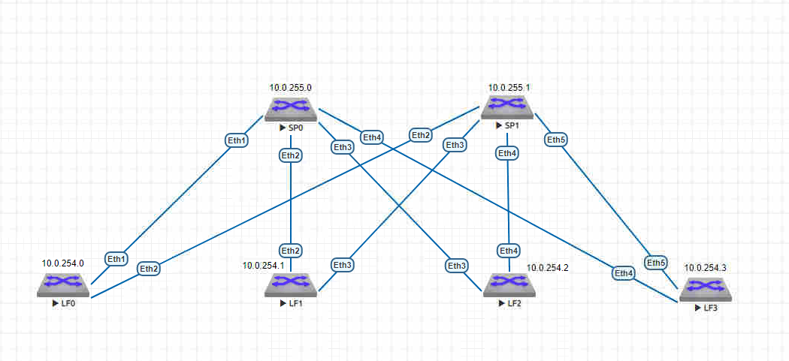

# Underlay. BGP

### Задание: 
Настроить BGP для Underlay сети

### Схема:

### Таблица распределения IP-адресов
| Sysname       | IP                | Desc |
| ------------- |:------------------:| -----:|
| **SP0**     | **10.0.255.0/32**   |**Loop**|
| SP0    | 10.0.0.1/30 |  LF0 |
| SP0  | 10.0.0.5/30        |   LF1|
| SP0  | 10.0.0.9/30        |   LF2 |
| SP0  | 10.0.0.13/30        |   LF3 |
| **SP1**     | **10.0.255.1/32**   |**Loop** |
| SP1    | 10.0.1.1/30 |  LF0 |
| SP1  | 10.0.1.5/30        |   LF1|
| SP1  | 10.0.1.9/30        |   LF2 |
| SP1  | 10.0.1.13/30        |   LF23 |
| **LF0**     | **10.0.254.0/32**   |**Loop** |
| LF0  | 10.0.0.2/30        |   SP0|
| LF0  | 10.0.1.2/30        |   SP1 |
| **LF1**    | **10.0.254.1/32**   |**Loop** |
| LF1  | 10.0.0.6/30        |   SP0|
| LF1  | 10.0.1.6/30        |   SP1 |
| **LF2**    | **10.0.254.2/32**   |**Loop** |
| LF2  | 10.0.0.10/30        |   SP0|
| LF2  | 10.0.1.10/30        |   SP1 |
| **LF3**    | **10.0.254.3/32**   |**Loop** |
| LF3  | 10.0.0.14/30        |   SP0|
| LF3  | 10.0.1.14/30        |   SP1 |

### Выводы SP0:
```
SP0#sh ip bgp
BGP routing table information for VRF default
Router identifier 10.0.255.0, local AS number 65000
Route status codes: * - valid, > - active, # - not installed, E - ECMP head, e - ECMP
                    S - Stale, c - Contributing to ECMP, b - backup, L - labeled-unicast
Origin codes: i - IGP, e - EGP, ? - incomplete
AS Path Attributes: Or-ID - Originator ID, C-LST - Cluster List, LL Nexthop - Link Local Nexthop

         Network                Next Hop            Metric  LocPref Weight  Path
 * >     10.0.0.0/30            -                     1       0       -       i
 * >     10.0.0.4/30            -                     1       0       -       i
 * >     10.0.0.8/30            -                     1       0       -       i
 * >     10.0.0.12/30           -                     1       0       -       i
 * >     10.0.254.0/32          10.0.0.2              0       100     0       i
 * >     10.0.254.1/32          10.0.0.6              0       100     0       i
 * >     10.0.254.2/32          10.0.0.10             0       100     0       i
 * >     10.0.254.3/32          10.0.0.14             0       100     0       i
 * >     10.0.255.0/32          -                     0       0       -       i
 
```
```
 SP0#sh bfd peers pro bgp
VRF name: default
-----------------
DstAddr        MyDisc    YourDisc  Interface/Transport    Type          LastUp
---------- ----------- ----------- -------------------- ------- ---------------
10.0.0.2    666356835   645000367        Ethernet1(13)  normal  06/09/24 17:23
10.0.0.6   4104227567  3538853221        Ethernet2(14)  normal  06/09/24 17:53
10.0.0.10   515328530  2511552499        Ethernet3(15)  normal  06/09/24 17:37
10.0.0.14   772522479  4241931294        Ethernet4(16)  normal  06/09/24 17:39

   LastDown            LastDiag    State
-------------- ------------------- -----
         NA       No Diagnostic       Up
         NA       No Diagnostic       Up
         NA       No Diagnostic       Up
         NA       No Diagnostic       Up
```
```
SP0#sh ip rou

VRF: default
Codes: C - connected, S - static, K - kernel,
       O - OSPF, IA - OSPF inter area, E1 - OSPF external type 1,
       E2 - OSPF external type 2, N1 - OSPF NSSA external type 1,
       N2 - OSPF NSSA external type2, B - Other BGP Routes,
       B I - iBGP, B E - eBGP, R - RIP, I L1 - IS-IS level 1,
       I L2 - IS-IS level 2, O3 - OSPFv3, A B - BGP Aggregate,
       A O - OSPF Summary, NG - Nexthop Group Static Route,
       V - VXLAN Control Service, M - Martian,
       DH - DHCP client installed default route,
       DP - Dynamic Policy Route, L - VRF Leaked,
       G  - gRIBI, RC - Route Cache Route

Gateway of last resort is not set

 C        10.0.0.0/30 is directly connected, Ethernet1
 C        10.0.0.4/30 is directly connected, Ethernet2
 C        10.0.0.8/30 is directly connected, Ethernet3
 C        10.0.0.12/30 is directly connected, Ethernet4
 B I      10.0.254.0/32 [200/0] via 10.0.0.2, Ethernet1
 B I      10.0.254.1/32 [200/0] via 10.0.0.6, Ethernet2
 B I      10.0.254.2/32 [200/0] via 10.0.0.10, Ethernet3
 B I      10.0.254.3/32 [200/0] via 10.0.0.14, Ethernet4
 C        10.0.255.0/32 is directly connected, Loopback0
```
 ### Выводы SP1:
```
 SP1#sh ip bgp
BGP routing table information for VRF default
Router identifier 10.0.255.1, local AS number 65000
Route status codes: * - valid, > - active, # - not installed, E - ECMP head, e - ECMP
                    S - Stale, c - Contributing to ECMP, b - backup, L - labeled-unicast
Origin codes: i - IGP, e - EGP, ? - incomplete
AS Path Attributes: Or-ID - Originator ID, C-LST - Cluster List, LL Nexthop - Link Local Nexthop

         Network                Next Hop            Metric  LocPref Weight  Path
 * >     10.0.1.0/30            -                     1       0       -       i
 * >     10.0.1.4/30            -                     1       0       -       i
 * >     10.0.1.8/30            -                     1       0       -       i
 * >     10.0.1.12/30           -                     1       0       -       i
 * >     10.0.254.0/32          10.0.1.2              0       100     0       i
 * >     10.0.254.1/32          10.0.1.6              0       100     0       i
 * >     10.0.254.2/32          10.0.1.10             0       100     0       i
 * >     10.0.254.3/32          10.0.1.14             0       100     0       i
 * >     10.0.255.1/32          -                     0       0       -       i
SP1#
```
```
SP1#sh bfd peer pro bgp
VRF name: default
-----------------
DstAddr        MyDisc    YourDisc  Interface/Transport    Type          LastUp
---------- ----------- ----------- -------------------- ------- ---------------
10.0.1.2   3858513097  3847097214        Ethernet2(14)  normal  06/09/24 17:46
10.0.1.6   3978585138   842536514        Ethernet3(15)  normal  06/09/24 17:53
10.0.1.10  3141042385   106044964        Ethernet4(16)  normal  06/09/24 17:48
10.0.1.14  1748557315   771511608        Ethernet5(17)  normal  06/09/24 17:47

   LastDown            LastDiag    State
-------------- ------------------- -----
         NA       No Diagnostic       Up
         NA       No Diagnostic       Up
         NA       No Diagnostic       Up
         NA       No Diagnostic       Up
```
```
SP1#sh ip rou

VRF: default
Codes: C - connected, S - static, K - kernel,
       O - OSPF, IA - OSPF inter area, E1 - OSPF external type 1,
       E2 - OSPF external type 2, N1 - OSPF NSSA external type 1,
       N2 - OSPF NSSA external type2, B - Other BGP Routes,
       B I - iBGP, B E - eBGP, R - RIP, I L1 - IS-IS level 1,
       I L2 - IS-IS level 2, O3 - OSPFv3, A B - BGP Aggregate,
       A O - OSPF Summary, NG - Nexthop Group Static Route,
       V - VXLAN Control Service, M - Martian,
       DH - DHCP client installed default route,
       DP - Dynamic Policy Route, L - VRF Leaked,
       G  - gRIBI, RC - Route Cache Route

Gateway of last resort is not set

 C        10.0.1.0/30 is directly connected, Ethernet2
 C        10.0.1.4/30 is directly connected, Ethernet3
 C        10.0.1.8/30 is directly connected, Ethernet4
 C        10.0.1.12/30 is directly connected, Ethernet5
 B I      10.0.254.0/32 [200/0] via 10.0.1.2, Ethernet2
 B I      10.0.254.1/32 [200/0] via 10.0.1.6, Ethernet3
 B I      10.0.254.2/32 [200/0] via 10.0.1.10, Ethernet4
 B I      10.0.254.3/32 [200/0] via 10.0.1.14, Ethernet5
 C        10.0.255.1/32 is directly connected, Loopback0
 ```
 ### Маршрутизация на LEAF
 ```
 LF0#sh ip rou
 ...
  C        10.0.0.0/30 is directly connected, Ethernet1
 B I      10.0.0.4/30 [200/0] via 10.0.0.1, Ethernet1
 B I      10.0.0.8/30 [200/0] via 10.0.0.1, Ethernet1
 B I      10.0.0.12/30 [200/0] via 10.0.0.1, Ethernet1
 C        10.0.1.0/30 is directly connected, Ethernet2
 B I      10.0.1.4/30 [200/0] via 10.0.1.1, Ethernet2
 B I      10.0.1.8/30 [200/0] via 10.0.1.1, Ethernet2
 B I      10.0.1.12/30 [200/0] via 10.0.1.1, Ethernet2
 C        10.0.254.0/32 is directly connected, Loopback0
 B I      10.0.254.1/32 [200/0] via 10.0.0.1, Ethernet1
 B I      10.0.254.2/32 [200/0] via 10.0.0.1, Ethernet1
 B I      10.0.254.3/32 [200/0] via 10.0.0.1, Ethernet1
 B I      10.0.255.0/32 [200/0] via 10.0.0.1, Ethernet1
 B I      10.0.255.1/32 [200/0] via 10.0.1.1, Ethernet2
 ```