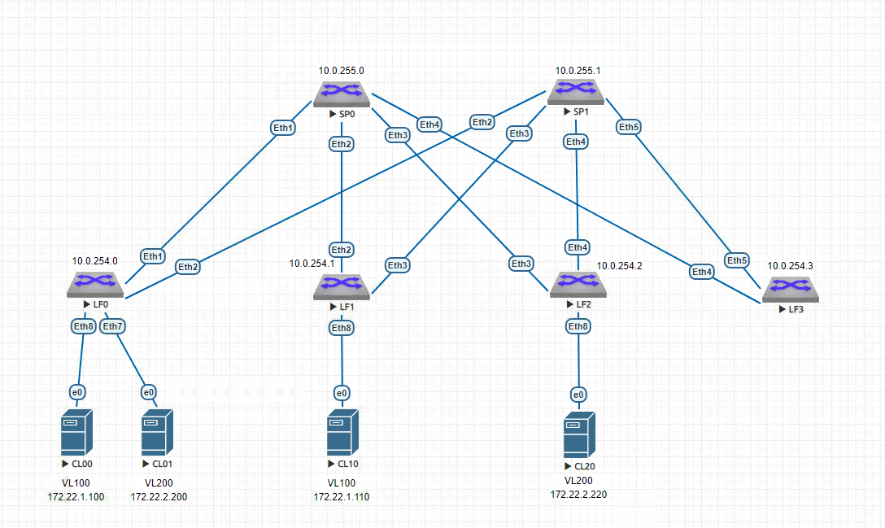

# VxLAN. L2 VNI

### Цель:
Настроить Overlay на основе VxLAN EVPN для L2 связанности между клиентами

### Схема:


### Таблица распределения IP-адресов
| Sysname       | IP                | Desc |
| ------------- |:------------------:| -----:|
| **SP0**     | **10.0.255.0/32**   |**Loop**|
| SP0    | 10.0.0.1/30 |  LF0 |
| SP0  | 10.0.0.5/30        |   LF1|
| SP0  | 10.0.0.9/30        |   LF2 |
| SP0  | 10.0.0.13/30        |   LF3 |
| **SP1**     | **10.0.255.1/32**   |**Loop** |
| SP1    | 10.0.1.1/30 |  LF0 |
| SP1  | 10.0.1.5/30        |   LF1|
| SP1  | 10.0.1.9/30        |   LF2 |
| SP1  | 10.0.1.13/30        |   LF23 |
| **LF0**     | **10.0.254.0/32**   |**Loop** |
| LF0  | 10.0.0.2/30        |   SP0|
| LF0  | 10.0.1.2/30        |   SP1 |
| **LF1**    | **10.0.254.1/32**   |**Loop** |
| LF1  | 10.0.0.6/30        |   SP0|
| LF1  | 10.0.1.6/30        |   SP1 |
| **LF2**    | **10.0.254.2/32**   |**Loop** |
| LF2  | 10.0.0.10/30        |   SP0|
| LF2  | 10.0.1.10/30        |   SP1 |
| **LF3**    | **10.0.254.3/32**   |**Loop** |
| LF3  | 10.0.0.14/30        |   SP0|
| LF3  | 10.0.1.14/30        |   SP1 |
| CL00 | 172.22.1.100/24    |   VL 100 |
| CL01 | 172.22.2.200/24    |   VL 200 |
| CL10 | 172.22.1.110/24    |   VL 100 |
| CL20 | 172.22.2.220/24    |   VL 200 |

### Выводы LF0:
``` 
LF0#sh bgp summ
BGP summary information for VRF default
Router identifier 10.0.254.0, local AS number 65000
Neighbor            AS Session State AFI/SAFI                AFI/SAFI State   NLRI Rcd   NLRI Acc
---------- ----------- ------------- ----------------------- -------------- ---------- ----------
10.0.0.1         65000 Established   IPv4 Unicast            Negotiated              8          8
10.0.1.1         65000 Established   IPv4 Unicast            Negotiated              8          8
10.0.255.0       65000 Established   IPv4 Unicast            Negotiated              8          8
10.0.255.0       65000 Established   L2VPN EVPN              Negotiated              2          2
10.0.255.1       65000 Established   IPv4 Unicast            Negotiated              8          8
10.0.255.1       65000 Established   L2VPN EVPN              Negotiated              2          2
``` 
``` 
LF0#show vxlan address-table
          Vxlan Mac Address Table
----------------------------------------------------------------------

VLAN  Mac Address     Type      Prt  VTEP             Moves   Last Move
----  -----------     ----      ---  ----             -----   ---------
 100  5000.00ae.f703  EVPN      Vx1  10.0.254.1       1       0:00:17 ago
 200  5000.002f.d8fe  EVPN      Vx1  10.0.254.2       1       0:00:22 ago
Total Remote Mac Addresses for this criterion: 2
``` 
``` 
LF0#show vxlan vtep
Remote VTEPS for Vxlan1:

VTEP             Tunnel Type(s)
---------------- --------------
10.0.254.1       flood, unicast
10.0.254.2       flood, unicast

Total number of remote VTEPS:  2
``` 
```
LF0#show bgp evpn route-type mac-ip
BGP routing table information for VRF default
Router identifier 10.0.254.0, local AS number 65000
Route status codes: * - valid, > - active, S - Stale, E - ECMP head, e - ECMP
                    c - Contributing to ECMP, % - Pending BGP convergence
Origin codes: i - IGP, e - EGP, ? - incomplete
AS Path Attributes: Or-ID - Originator ID, C-LST - Cluster List, LL Nexthop - Link Local Nexthop

          Network                Next Hop              Metric  LocPref Weight  Path
 * >Ec    RD: 65000:200 mac-ip 5000.002f.d8fe
                                 10.0.254.2            -       100     0       i Or-ID: 10.0.254.2 C-LST: 10.0.255.0
 *  ec    RD: 65000:200 mac-ip 5000.002f.d8fe
                                 10.0.254.2            -       100     0       i Or-ID: 10.0.254.2 C-LST: 10.0.255.1
 * >      RD: 65000:200 mac-ip 5000.0045.abdf
                                 -                     -       -       0       i
 * >      RD: 65000:100 mac-ip 5000.0088.fe27
                                 -                     -       -       0       i
 * >Ec    RD: 65000:100 mac-ip 5000.00ae.f703
                                 10.0.254.1            -       100     0       i Or-ID: 10.0.254.1 C-LST: 10.0.255.0
 *  ec    RD: 65000:100 mac-ip 5000.00ae.f703
                                 10.0.254.1            -       100     0       i Or-ID: 10.0.254.1 C-LST: 10.0.255.1
``` 
```
LF0#sh interfaces vxlan 1
Vxlan1 is up, line protocol is up (connected)
  Hardware is Vxlan
  Source interface is Loopback0 and is active with 10.0.254.0
  Listening on UDP port 4789
  Replication/Flood Mode is headend with Flood List Source: EVPN
  Remote MAC learning via EVPN
  VNI mapping to VLANs
  Static VLAN to VNI mapping is
    [100, 100]        [200, 200]
  Note: All Dynamic VLANs used by VCS are internal VLANs.
        Use 'show vxlan vni' for details.
  Static VRF to VNI mapping is not configured
  Headend replication flood vtep list is:
   100 10.0.254.1
   200 10.0.254.2
  Shared Router MAC is 0000.0000.0000
  LF0#show vxlan vni
VNI to VLAN Mapping for Vxlan1
VNI       VLAN       Source       Interface       802.1Q Tag
--------- ---------- ------------ --------------- ----------
100       100        static       Ethernet7       untagged
                                  Vxlan1          100
200       200        static       Ethernet8       untagged
                                  Vxlan1          200

VNI to dynamic VLAN Mapping for Vxlan1
VNI       VLAN       VRF       Source
--------- ---------- --------- ------------
```

### Торжество пинга состоялось: 
#CL00:
``` 
--- 172.22.1.110 ping statistics ---
5 packets transmitted, 5 received, 0% packet loss, time 54ms
rtt min/avg/max/mdev = 210.251/223.667/231.406/8.132 ms, pipe 5, ipg/ewma 13.608/226.510 ms
``` 

#CL01:
```
5 packets transmitted, 5 received, 0% packet loss, time 44ms
rtt min/avg/max/mdev = 258.757/267.975/278.838/6.405 ms, pipe 5, ipg/ewma 11.038/263.779 ms
``` 