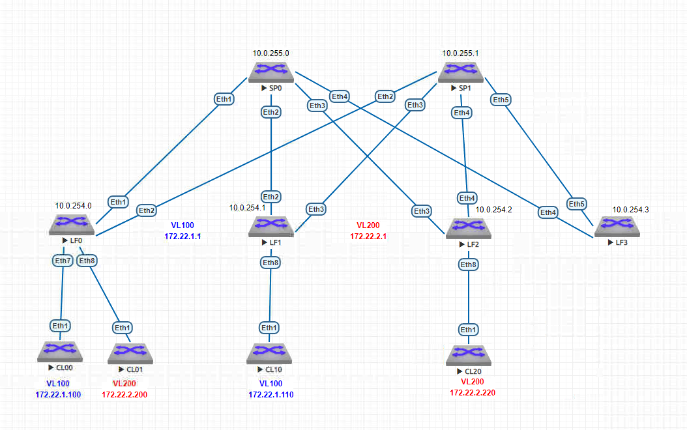

# VxLAN. L3 VNI

### Цель:
Настроить Overlay на основе VxLAN EVPN для L3 связанности между клиентами

### Схема:

### Таблица распределения IP-адресов
| Sysname       | IP                | Desc |
| ------------- |:------------------:| -----:|
| **SP0**     | **10.0.255.0/32**   |**Loop**|
| SP0    | 10.0.0.1/30 |  LF0 |
| SP0  | 10.0.0.5/30        |   LF1|
| SP0  | 10.0.0.9/30        |   LF2 |
| SP0  | 10.0.0.13/30        |   LF3 |
| **SP1**     | **10.0.255.1/32**   |**Loop** |
| SP1    | 10.0.1.1/30 |  LF0 |
| SP1  | 10.0.1.5/30        |   LF1|
| SP1  | 10.0.1.9/30        |   LF2 |
| SP1  | 10.0.1.13/30        |   LF23 |
| **LF0**     | **10.0.254.0/32**   |**Loop** |
| LF0  | 10.0.0.2/30        |   SP0|
| LF0  | 10.0.1.2/30        |   SP1 |
| **LF1**    | **10.0.254.1/32**   |**Loop** |
| LF1  | 10.0.0.6/30        |   SP0|
| LF1  | 10.0.1.6/30        |   SP1 |
| **LF2**    | **10.0.254.2/32**   |**Loop** |
| LF2  | 10.0.0.10/30        |   SP0|
| LF2  | 10.0.1.10/30        |   SP1 |
| **LF3**    | **10.0.254.3/32**   |**Loop** |
| LF3  | 10.0.0.14/30        |   SP0|
| LF3  | 10.0.1.14/30        |   SP1 |
| CL00 | 172.22.1.100/24    |   VL 100 |
| CL01 | 172.22.2.200/24    |   VL 200 |
| CL10 | 172.22.1.110/24    |   VL 100 |
| CL20 | 172.22.2.220/24    |   VL 200 |
