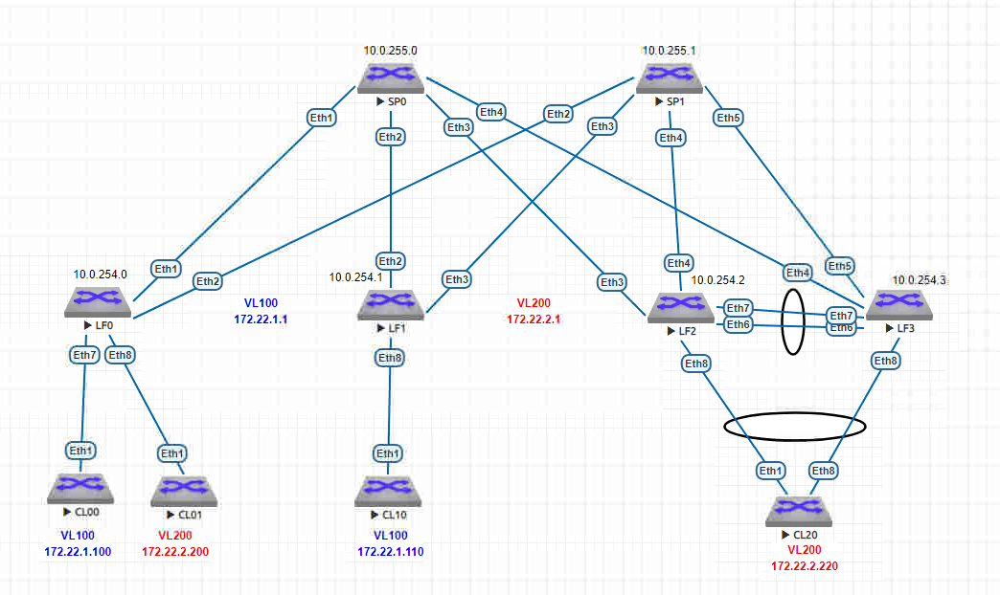

# VXLAN. Multihoming.

### Цель:
1. Подключить клиентов 2-я линками к различным Leaf
2. Настроить агрегированный канал со стороны клиента
3. Настроить multihoming для работы в Overlay сети. 

### Схема:


### Таблица распределения IP-адресов
| Sysname       | IP                | Desc |
| ------------- |:------------------:| -----:|
| **SP0**     | **10.0.255.0/32**   |**Loop**|
| SP0    | 10.0.0.1/30 |  LF0 |
| SP0  | 10.0.0.5/30        |   LF1|
| SP0  | 10.0.0.9/30        |   LF2 |
| SP0  | 10.0.0.13/30        |   LF3 |
| **SP1**     | **10.0.255.1/32**   |**Loop** |
| SP1    | 10.0.1.1/30 |  LF0 |
| SP1  | 10.0.1.5/30        |   LF1|
| SP1  | 10.0.1.9/30        |   LF2 |
| SP1  | 10.0.1.13/30        |   LF23 |
|    |    |    |
| **VL 100**     | **172.22.1.1**   |**VIP** |
| **VL 200**     | **172.22.2.1**   |**VIP** |
|    |    |    |
| **LF0**     | **10.0.254.0/32**   |**Loop** |
| LF0  | 10.0.0.2/30        |   SP0|
| LF0  | 10.0.1.2/30        |   SP1 |
| **LF1**    | **10.0.254.1/32**   |**Loop** |
| LF1  | 10.0.0.6/30        |   SP0|
| LF1  | 10.0.1.6/30        |   SP1 |
| **LF2**    | **10.0.254.2/32**   |**Loop** |
| LF2  | 10.0.0.10/30        |   SP0|
| LF2  | 10.0.1.10/30        |   SP1 |
| **LF3**    | **10.0.254.3/32**   |**Loop** |
| LF3  | 10.0.0.14/30        |   SP0|
| LF3  | 10.0.1.14/30        |   SP1 |
| CL00 | 172.22.1.100/24    |   VL 100 |
| CL01 | 172.22.2.200/24    |   VL 200 |
| CL10 | 172.22.1.110/24    |   VL 100 |
| CL20 | 172.22.2.220/24    |   VL 200 |

### Выводы 
### MLAG
``` 
LF3#sh mlag int det
                                        local/remote
 mlag         state   local   remote    oper    config    last change   changes
------ ------------- ------- -------- ------- --------- --------------- -------
   20   active-full    Po20     Po20   up/up   ena/ena   23:35:10 ago         4

LF2#sh mlag int det
                                        local/remote
 mlag         state   local   remote    oper    config    last change   changes
------ ------------- ------- -------- ------- --------- --------------- -------
   20   active-full    Po20     Po20   up/up   ena/ena   23:35:33 ago         4
   ``` 

   ### LF3
 ``` 
LF3#sh bgp evpn
BGP routing table information for VRF default
Router identifier 10.0.254.3, local AS number 65000
Route status codes: * - valid, > - active, S - Stale, E - ECMP head, e - ECMP
                    c - Contributing to ECMP, % - Pending BGP convergence
Origin codes: i - IGP, e - EGP, ? - incomplete
AS Path Attributes: Or-ID - Originator ID, C-LST - Cluster List, LL Nexthop - Link Local Nexthop

          Network                Next Hop              Metric  LocPref Weight  Path
 * >Ec    RD: 65000:100 imet 10.0.254.0
                                 10.0.254.0            -       100     0       i Or-ID: 10.0.254.0 C-LST: 10.0.255.0
 *  ec    RD: 65000:100 imet 10.0.254.0
                                 10.0.254.0            -       100     0       i Or-ID: 10.0.254.0 C-LST: 10.0.255.1
 * >Ec    RD: 65000:200 imet 10.0.254.0
                                 10.0.254.0            -       100     0       i Or-ID: 10.0.254.0 C-LST: 10.0.255.0
 *  ec    RD: 65000:200 imet 10.0.254.0
                                 10.0.254.0            -       100     0       i Or-ID: 10.0.254.0 C-LST: 10.0.255.1
 * >Ec    RD: 65000:100 imet 10.0.254.1
                                 10.0.254.1            -       100     0       i Or-ID: 10.0.254.1 C-LST: 10.0.255.0
 *  ec    RD: 65000:100 imet 10.0.254.1
                                 10.0.254.1            -       100     0       i Or-ID: 10.0.254.1 C-LST: 10.0.255.1
 * >Ec    RD: 65000:200 imet 10.0.254.2
                                 10.0.254.2            -       100     0       i Or-ID: 10.0.254.2 C-LST: 10.0.255.1
 *  ec    RD: 65000:200 imet 10.0.254.2
                                 10.0.254.2            -       100     0       i Or-ID: 10.0.254.2 C-LST: 10.0.255.0
 * >      RD: 65000:200 imet 10.0.254.3
                                 -                     -       -       0       i
 * >Ec    RD: 65000:1 ip-prefix 172.22.1.0/24
                                 10.0.254.0            -       100     0       i Or-ID: 10.0.254.0 C-LST: 10.0.255.0
 *  ec    RD: 65000:1 ip-prefix 172.22.1.0/24
                                 10.0.254.0            -       100     0       i Or-ID: 10.0.254.0 C-LST: 10.0.255.1
 * >      RD: 65000:1 ip-prefix 172.22.2.0/24
                                 -                     -       -       0       i
 *        RD: 65000:1 ip-prefix 172.22.2.0/24
                                 10.0.254.0            -       100     0       i Or-ID: 10.0.254.0 C-LST: 10.0.255.1
 *        RD: 65000:1 ip-prefix 172.22.2.0/24
                                 10.0.254.0            -       100     0       i Or-ID: 10.0.254.0 C-LST: 10.0.255.0
LF3#
``` 
``` 
LF3#sh vxlan address-table
          Vxlan Mac Address Table
----------------------------------------------------------------------

VLAN  Mac Address     Type      Prt  VTEP             Moves   Last Move
----  -----------     ----      ---  ----             -----   ---------
 200  5000.0045.abdf  EVPN      Vx1  10.0.254.0       1       0:00:26 ago
4093  5000.0003.3766  EVPN      Vx1  10.0.254.1       1       0:00:03 ago
4093  5000.00d5.5dc0  EVPN      Vx1  10.0.254.0       1       0:16:15 ago
Total Remote Mac Addresses for this criterion: 3
``` 
### Торжество пинга состоялось: 
CL20 > CL00
``` 
--- 172.22.1.100 ping statistics ---
5 packets transmitted, 5 received, 0% packet loss, time 48ms
rtt min/avg/max/mdev = 62.393/78.361/91.817/10.718 ms, pipe 5, ipg/ewma 12.136/84.283 ms
``` 
CL20 > CL01
``` 
--- 172.22.2.200 ping statistics ---
5 packets transmitted, 5 received, 0% packet loss, time 54ms
rtt min/avg/max/mdev = 39.838/56.221/70.046/11.027 ms, pipe 5, ipg/ewma 13.541/62.306 ms
``` 
CL20 > CL10
``` 
--- 172.22.1.110 ping statistics ---
5 packets transmitted, 5 received, 0% packet loss, time 54ms
rtt min/avg/max/mdev = 114.986/130.208/139.790/9.135 ms, pipe 5, ipg/ewma 13.694/133.145 ms
``` 