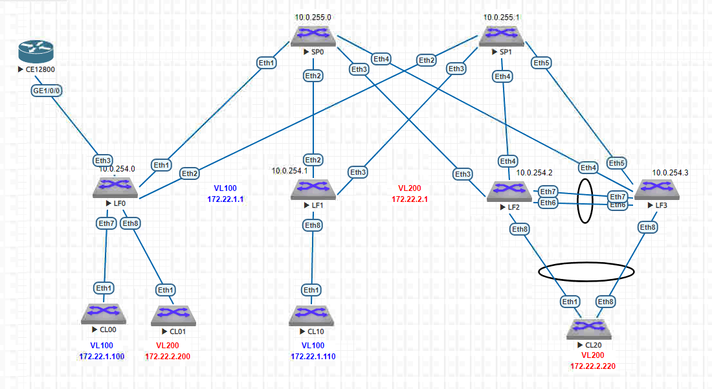

# EVPN. Route-type 5

### Цель:
1. Анонсировать суммарные префиксы клиентов в Overlay сеть
2. Настроить маршрутизацию между клиентами через суммарный префикс

### Схема:


### Таблица распределения IP-адресов
| Sysname       | IP                | Desc |
| ------------- |:------------------:| -----:|
| **SP0**     | **10.0.255.0/32**   |**Loop**|
| SP0    | 10.0.0.1/30 |  LF0 |
| SP0  | 10.0.0.5/30        |   LF1|
| SP0  | 10.0.0.9/30        |   LF2 |
| SP0  | 10.0.0.13/30        |   LF3 |
| **SP1**     | **10.0.255.1/32**   |**Loop** |
| SP1    | 10.0.1.1/30 |  LF0 |
| SP1  | 10.0.1.5/30        |   LF1|
| SP1  | 10.0.1.9/30        |   LF2 |
| SP1  | 10.0.1.13/30        |   LF23 |
|    |    |    |
| **VL 100**     | **172.22.1.1**   |**VIP** |
| **VL 200**     | **172.22.2.1**   |**VIP** |
|    |    |    |
| **LF0**     | **10.0.254.0/32**   |**Loop** |
| LF0  | 10.0.0.2/30        |   SP0|
| LF0  | 10.0.1.2/30        |   SP1 |
| LF0  | 10.0.255.253/30        |   Router |
| **Router**     | **1.1.1.1/32**   |**Loop** |
| Router  | 10.0.255.254/30        |   LF0 |
| **LF1**    | **10.0.254.1/32**   |**Loop** |
| LF1  | 10.0.0.6/30        |   SP0|
| LF1  | 10.0.1.6/30        |   SP1 |
| **LF2**    | **10.0.254.2/32**   |**Loop** |
| LF2  | 10.0.0.10/30        |   SP0|
| LF2  | 10.0.1.10/30        |   SP1 |
| **LF3**    | **10.0.254.3/32**   |**Loop** |
| LF3  | 10.0.0.14/30        |   SP0|
| LF3  | 10.0.1.14/30        |   SP1 |
| CL00 | 172.22.1.100/24    |   VL 100 |
| CL01 | 172.22.2.200/24    |   VL 200 |
| CL10 | 172.22.1.110/24    |   VL 100 |
| CL20 | 172.22.2.220/24    |   VL 200 |

### Выводы 
### LF0
``` 
LF0#sh ip route vrf EVPNL3

VRF: EVPNL3
Codes: C - connected, S - static, K - kernel,
       O - OSPF, IA - OSPF inter area, E1 - OSPF external type 1,
       E2 - OSPF external type 2, N1 - OSPF NSSA external type 1,
       N2 - OSPF NSSA external type2, B - Other BGP Routes,
       B I - iBGP, B E - eBGP, R - RIP, I L1 - IS-IS level 1,
       I L2 - IS-IS level 2, O3 - OSPFv3, A B - BGP Aggregate,
       A O - OSPF Summary, NG - Nexthop Group Static Route,
       V - VXLAN Control Service, M - Martian,
       DH - DHCP client installed default route,
       DP - Dynamic Policy Route, L - VRF Leaked,
       G  - gRIBI, RC - Route Cache Route

Gateway of last resort is not set

 B E      1.1.1.1/32 [200/0] via 10.0.255.254, Ethernet3
 C        10.0.255.252/30 is directly connected, Ethernet3
 B I      172.22.1.110/32 [200/0] via VTEP 10.0.254.1 VNI 1 router-mac 50:00:00:03:37:66 local-interface Vxlan1
 C        172.22.1.0/24 is directly connected, Vlan100
 C        172.22.2.0/24 is directly connected, Vlan200
 A B      172.22.0.0/16 is directly connected, Null0	  
``` 
### Router
``` 
[~Router-bgp]dis ip routing-table
Proto: Protocol        Pre: Preference
Route Flags: R - relay, D - download to fib, T - to vpn-instance, B - black hole route
------------------------------------------------------------------------------
Routing Table : _public_
         Destinations : 10       Routes : 10

Destination/Mask    Proto   Pre  Cost        Flags NextHop         Interface

        0.0.0.0/0   Static  60   0             DB  0.0.0.0         NULL0
        1.1.1.1/32  Direct  0    0             D   127.0.0.1       LoopBack0
   10.0.255.252/30  Direct  0    0             D   10.0.255.254    GE1/0/0
   10.0.255.254/32  Direct  0    0             D   127.0.0.1       GE1/0/0
   10.0.255.255/32  Direct  0    0             D   127.0.0.1       GE1/0/0
     172.22.0.0/16  EBGP    255  0             RD  10.0.255.253    GE1/0/0

<Router>ping -a 1.1.1.1 172.22.1.110

  --- 172.22.1.110 ping statistics ---
    5 packet(s) transmitted
    5 packet(s) received
    0.00% packet loss
    round-trip min/avg/max = 56/68/94 ms
	
<Router>ping -a 1.1.1.1 172.22.2.220

  --- 172.22.2.220 ping statistics ---
    5 packet(s) transmitted
    5 packet(s) received
    0.00% packet loss
    round-trip min/avg/max = 71/194/361 ms
``` 

### CL10
``` 
CL10>ping 1.1.1.1

--- 1.1.1.1 ping statistics ---
5 packets transmitted, 5 received, 0% packet loss, time 51ms
rtt min/avg/max/mdev = 390.075/441.843/463.858/26.403 ms, pipe 5, ipg/ewma 12.777/416.862 ms
``` 
### LF1
```
LF1#sh ip route vrf EVPNL3

Gateway of last resort is not set

 B I      1.1.1.1/32 [200/0] via VTEP 10.0.254.0 VNI 1 router-mac 50:00:00:d5:5d:c0 local-interface Vxlan1
 B I      10.0.255.252/30 [200/0] via VTEP 10.0.254.0 VNI 1 router-mac 50:00:00:d5:5d:c0 local-interface Vxlan1
 B I      172.22.1.100/32 [200/0] via VTEP 10.0.254.0 VNI 1 router-mac 50:00:00:d5:5d:c0 local-interface Vxlan1
 C        172.22.1.0/24 is directly connected, Vlan100
 B I      172.22.2.220/32 [200/0] via VTEP 10.0.254.2 VNI 1 router-mac 50:00:00:15:f4:e8 local-interface Vxlan1
 B I      172.22.2.0/24 [200/0] via VTEP 10.0.254.0 VNI 1 router-mac 50:00:00:d5:5d:c0 local-interface Vxlan1
 B I      172.22.0.0/16 [200/0] via VTEP 10.0.254.0 VNI 1 router-mac 50:00:00:d5:5d:c0 local-interface Vxlan1
```